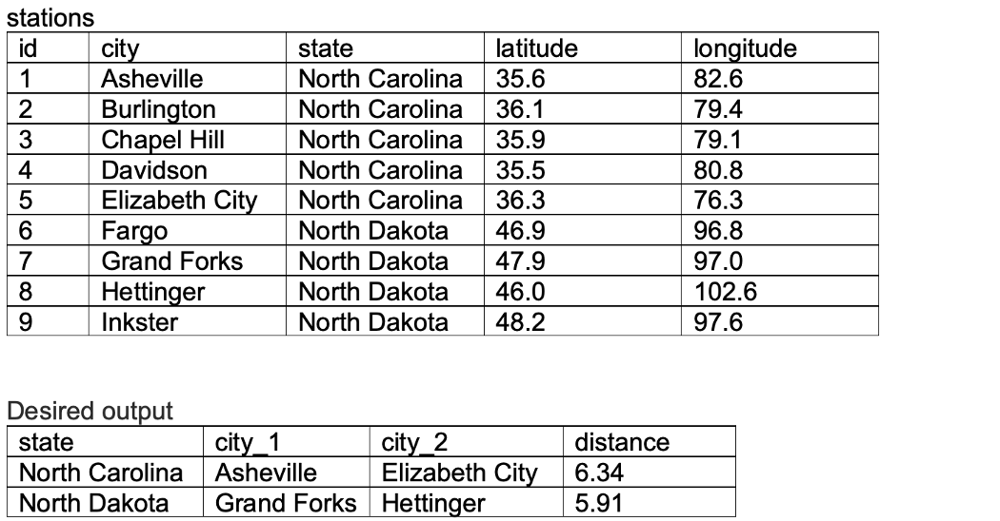
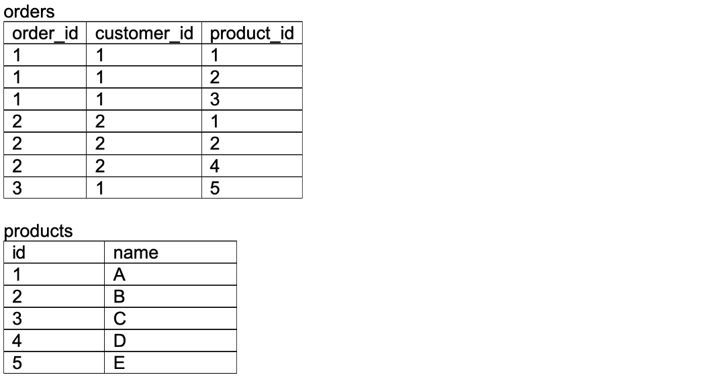

For the following tasks you have to write sql queries. You may need the following expressions:
- Basic retrieval (SELECT, FROM)
- Creating and aliasing (WITH, AS, GENERATE_SERIES)
- Filtering (DISTINCT, WHERE, HAVING, AND, OR, IN, NOT IN)
- Aggregation (GROUP BY with COUNT, SUM, AVERAGE)
- Joins (INNER JOIN, LEFT JOIN, FULL OUTER JOIN on one or multiple (in)equalities, CROSS JOIN, UNION and UNION ALL)
- Conditional statements (CASE - WHEN - THEN - ELSE - END)
- Window functions (RANK, DENSE_RANK, ROW_NUMBER, SUM with PARTITION BY - ORDER BY)
- Formatting (LIMIT, ORDER BY, casting as an integer, float, or date, CONCAT, COALESCE)
- Arithmetic operations and comparisons (+, -, *, /, //, ^, <, >, =, !=)
- Datetime operations (EXTRACT(month/day/year))

1. From the following table of user IDs, actions, and dates, write a query to return the publication and cancellation rate for each user.

2. From the following table of transactions between two users, write a query to return the change in net worth for each user, ordered by decreasing net change.

3. From the following table containing a list of dates and items ordered, write a query to return the most frequent item ordered on each date. Return multiple items in the case of a tie.

4. From the following table of user actions, write a query to return for each user the time elapsed between the last action and the second-to-last action, in ascending order by user ID.

5. A company defines its super users as those who have made at least two transactions. From the following table, write a query to return, for each user, the date when they become a super user, ordered by oldest super users first. Users who are not super users should also be present in the table.

6. Using the following two tables, write a query to return page recommendations to a social media user based on the pages that their friends have liked, but that they have not yet marked as liked. Order the result by ascending user ID.

7. With the following two tables, return the fraction of users who only visited mobile, only visited web, and visited both. 

8. Given the following two tables, return the fraction of users, rounded to two decimal places, who accessed feature two (type: F2 in events table) and upgraded to premium within the first 30 days of signing up.

9. Given the following table, return a list of users and their corresponding friend count. Order the result by descending friend count, and in the case of a tie, by ascending user ID. Assume that only unique friendships are displayed (i.e., [1, 2] will not show up again as [2, 1] ).

10. The projects table contains three columns: task_id, start_date, and end_date. The difference between end_date and start_date is 1 day for each row in the table. If task end dates are consecutive they are part of the same project. Projects do not overlap.

Write a query to return the start and end dates of each project, and the number of days it took to complete. Order by ascending project duration, and ascending start date in the case of a tie.

11. Given the following two tables, write a query to return the fraction of students, rounded to two decimal places, who attended school (attendance = 1) on their birthday.

12. Given the following two tables, write a query to return the hacker ID, name, and total score (the sum of maximum scores for each challenge completed) ordered by descending score, and by ascending hacker ID in the case of score tie. Do not display entries for hackers with a score of zero. 

13. Write a query to rank scores in the following table without using a window function. If there is a tie between two scores, both should have the same rank. After a tie, the following rank should be the next consecutive integer value.

14. The following table holds monthly salary information for several employees. Write a query to get, for each month, the cumulative sum of an employee’s salary over a period of 3 months, excluding the most recent month. The result should be ordered by ascending employee ID and month. 

15. Write a query to return the scores of each team in the teams table after all matches displayed in the matches table. Points are awarded as follows: zero points for a loss, one point for a tie, and three points for a win. The result should include team name and points, and be ordered by decreasing points. In case of a tie, order by alphabetized team name.

16. From the following table, write a query to display the ID and name of customers who bought products A and B, but didn’t buy product C, ordered by ascending customer ID.

17. Write a query to return the median latitude of weather stations from each state in the following table, rounding to the nearest tenth of a degree. Note that there is no MEDIAN() function in SQL! 

18. From the same table in question 17, write a query to return the furthest-separated pair of cities for each state, and the corresponding distance (in degrees, rounded to 2 decimal places) between those two cities. 

19. Write a query to return the average cycle time across each month. Cycle time is the time elapsed between one user joining and their invitees joining. Users who joined without an invitation have a zero in the “invited by” column.

20. The attendance table logs the number of people counted in a crowd each day an event is held. Write a query to return a table showing the date and visitor count of high-attendance periods, defined as three consecutive entries (not necessarily consecutive dates) with more than 100 visitors.

21. Using the following two tables, write a query to return the names and purchase frequency of the top three pairs of products most often bought together. The names of both products should appear in one column.

22. From the following table summarizing the results of a study, calculate the average treatment effect as well as upper and lower bounds of the 95% confidence interval. Round these numbers to 3 decimal places.

23. The following table shows the monthly salary for an employee for the first nine months in a given year. From this, write a query to return a table that displays, for each month in the first half of the year, the rolling sum of the employee’s salary for that month and the following two months, ordered chronologically.

24. From the given trips and users tables for a taxi service, write a query to return the cancellation rate in the first two days in October, rounded to two decimal places, for trips not involving banned riders or drivers.

25. From the following user activity table, write a query to return the fraction of users who are retained (show some activity) a given number of days after joining. By convention, users are considered active on their join day (day 0).

